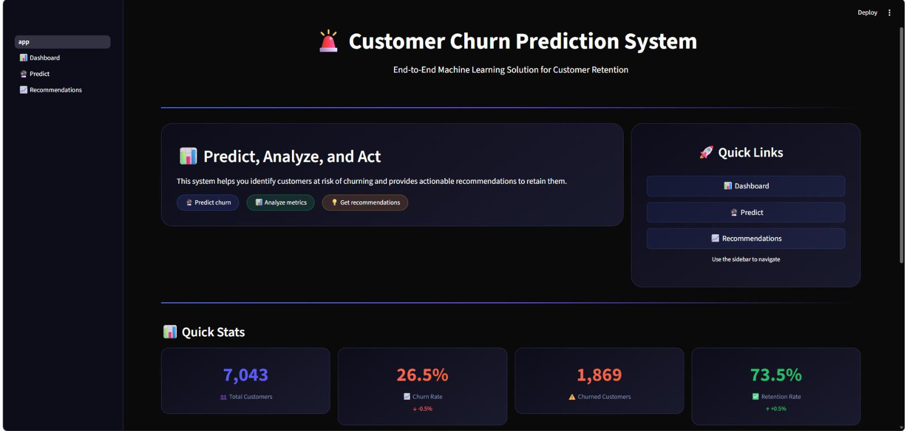
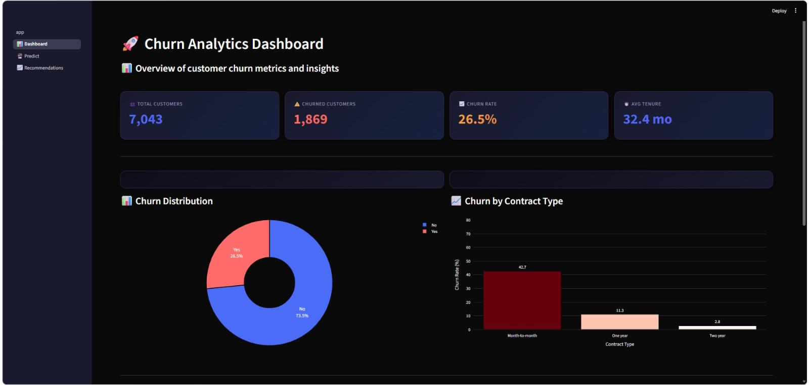
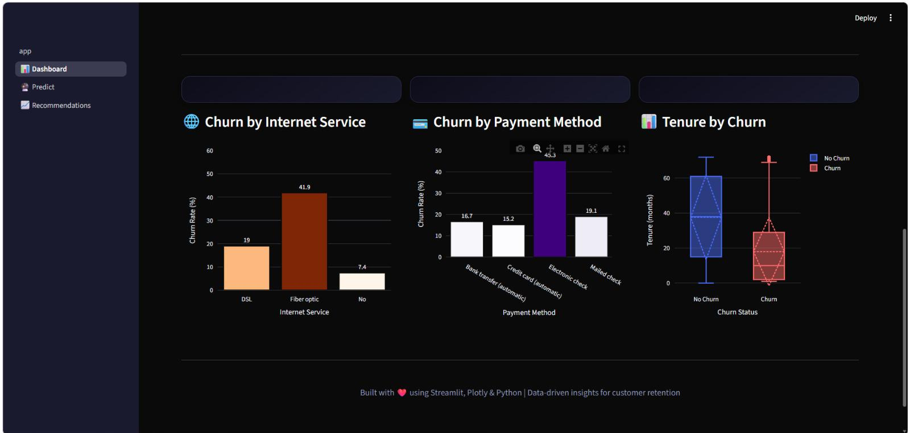
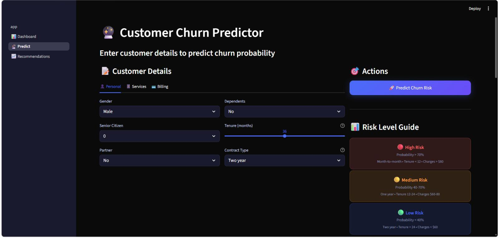
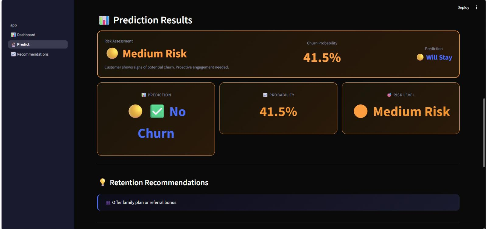
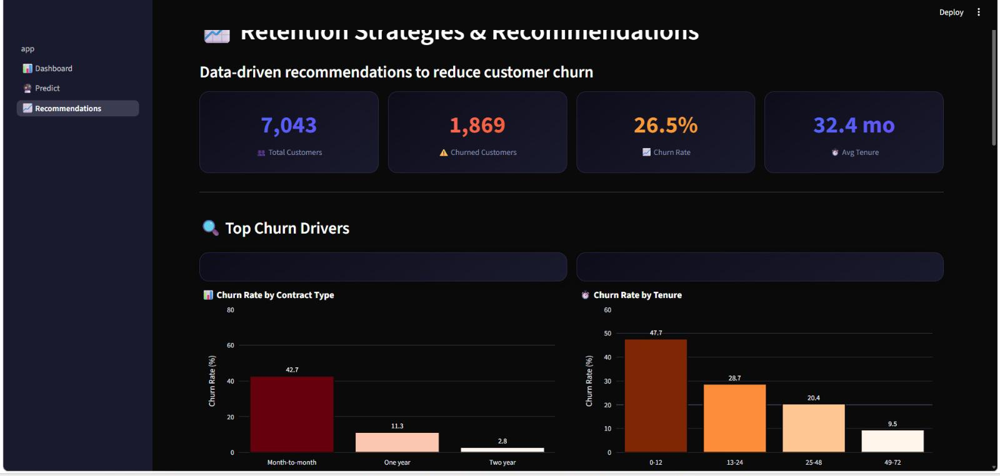
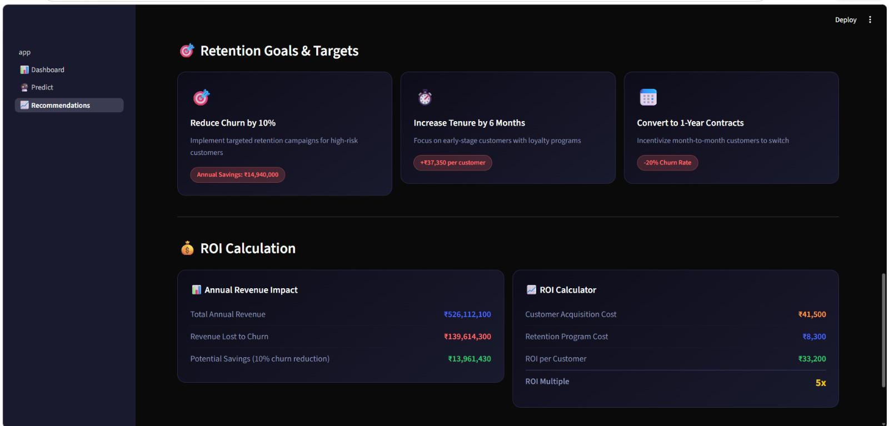
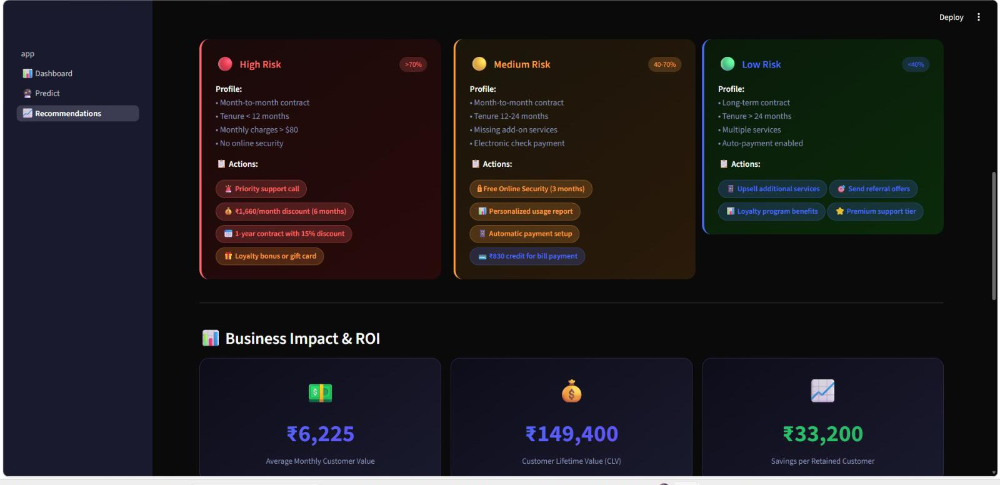

# 🚨 Customer Churn Prediction System

[](https://www.python.org/)
[](https://streamlit.io/)
[](https://www.docker.com/)
[](LICENSE)
[]()

> **End-to-End Machine Learning System for Customer Retention**

---

## 📌 Overview

This project is an **end-to-end machine learning solution** that helps businesses identify customers at risk of churning and provides **actionable retention strategies**. Built with a **Random Forest model** achieving **81% accuracy**, it enables proactive customer retention.

### Key Features:

- 🔮 **Predict** churn probability for individual customers
- 📊 **Dashboard** with key metrics and visualizations
- 💡 **Actionable Recommendations** for retention strategies
- 🔬 **What-if Simulator** to test different scenarios
- 🌙 **Dark Theme** for professional user experience
- 💰 **Indian Rupees (₹)** pricing for local relevance

---

## 📸 Screenshots

### 🏠 Main Page


### 📊 Dashboard


### 📊 Dashboard - More Charts


### 🔮 Predictor


### 📊 Prediction Result


### 📈 Recommendations


### 💰 ROI & Business Impact


### 🎯 Retention Strategies


---

## 🎯 Business Problem

Customer churn is a critical challenge for subscription-based businesses:
- Acquiring new customers costs **5-10x more** than retaining existing ones
- Reducing churn by just **5%** can increase profits by **25-95%**
- This system helps businesses **proactively identify** at-risk customers

---

## 📊 Dataset

- **Source:** Telco Customer Churn (Kaggle)
- **Records:** 7,043 customers
- **Features:** 21 (demographics, account info, services, billing)
- **Churn Rate:** 26.5% (imbalanced dataset)

---

## 🛠️ Tech Stack

### Data Science & ML
| Tool | Purpose |
|------|---------|
| **Python 3.10** | Core programming language |
| **Pandas, NumPy** | Data manipulation |
| **Scikit-learn** | Machine Learning models |
| **SMOTE** | Handling class imbalance |
| **SHAP** | Model interpretability |

### Frontend & Deployment
| Tool | Purpose |
|------|---------|
| **Streamlit** | Interactive dashboard |
| **Plotly** | Interactive visualizations |
| **Docker** | Containerization |

---

## 📁 Project Structure

customer-churn-prediction/
│
├── app/ # Streamlit frontend
│ ├── app.py # Main app
│ └── pages/
│ ├── 1_📊_Dashboard.py # Analytics dashboard
│ ├── 2_🔮_Predict.py # Prediction page
│ └── 3_📈_Recommendations.py # Strategies page
│
├── src/ # Production code
│ ├── data_loader.py # Data loading & cleaning
│ ├── preprocess.py # Feature engineering
│ ├── train.py # Model training
│ ├── predict.py # Prediction logic
│ ├── explain.py # Model explainability
│ └── recommendations.py # Retention strategies
│
├── tests/ # Unit tests
│ ├── test_predict.py
│ └── test_recommendations.py
│
├── models/ # Saved models
│ ├── churn_pipeline.pkl
│ └── scaler.pkl
│
├── data/ # Dataset
│ └── raw/
│ └── WA_Fn-UseC_-Telco-Customer-Churn.csv
│
├── .streamlit/ # Streamlit config
│ └── config.toml # Dark theme settings
│
├── Dockerfile # Docker configuration
├── requirements.txt # Dependencies
└── README.md # Documentation 


---

## 📈 Model Performance

### Key Metrics

| Metric | Score |
|--------|-------|
| **Accuracy** | 81.3% |
| **ROC AUC** | 0.87 |
| **F1 Score** | 0.72 |

### Feature Importance

| Feature | Importance |
|---------|------------|
| **Contract Type** | 34% |
| **Tenure** | 28% |
| **Monthly Charges** | 18% |
| **Online Security** | 8% |
| **Payment Method** | 6% |
| **Other Features** | 6% |

### Risk Levels

| Risk Level | Probability | Conditions |
|------------|-------------|------------|
| 🔴 **High Risk** | > 70% | Month-to-month, tenure < 12 months, charges > $80 |
| 🟡 **Medium Risk** | 40-70% | One year contract, tenure 12-24 months |
| 🟢 **Low Risk** | < 40% | Two year contract, tenure > 24 months, charges < $60 |

---

## 💡 Retention Strategies

The system provides **personalized recommendations** based on risk level:

### 🔴 High Risk Customers (Churn > 70%)
- 🚨 **Priority support call** within 24 hours
- 💰 **₹1,660/month discount** for 6 months
- 📅 **1-year contract** with 15% discount
- 🎁 **Loyalty bonus** or gift card

### 🟡 Medium Risk Customers (Churn 40-70%)
- 🔒 **Free Online Security** for 3 months
- 📊 **Personalized usage report**
- 📱 **Automatic payment setup**
- 💳 **₹830 credit** for bill payment

### 🟢 Low Risk Customers (Churn < 40%)
- 📱 **Upsell** additional services
- 🎯 **Referral offers**
- 📊 **Loyalty program** benefits
- ⭐ **Premium support tier**

---

## 🐳 Docker Deployment

### Build the Image
```bash
docker build -t churn-predictor .
## Run the Container
docker run -p 8501:8501 churn-predictor
